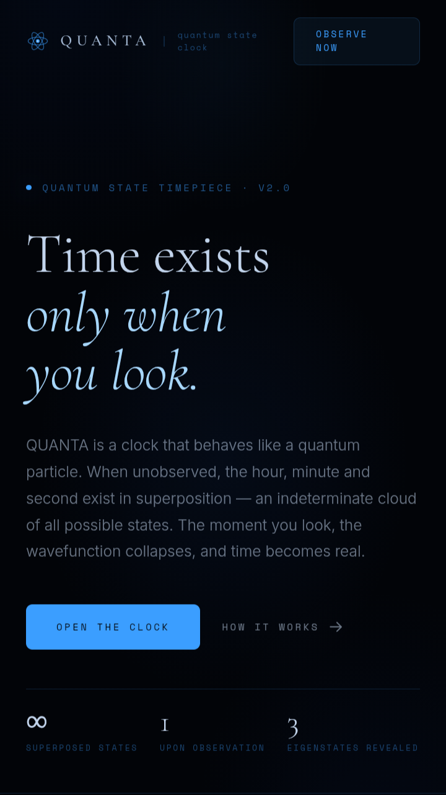

# QUANTA — Quantum State Clock

> The time is unknown. Until you decide to know it.

QUANTA is a single-page, dependency-free web experience that reimagines the humble clock through the lens of quantum mechanics. Instead of ticking numbers, you see a drifting cloud of probability. Nothing is certain — until you **observe** it, at which point the wavefunction collapses into a precise, glowing readout of hours, minutes, and seconds.

It's part interactive art piece, part physics metaphor, part clock.



🔗 **[Live demo](https://nazat02.github.io/QUANTA/)** · Landing page: `index.html` · Application: `simulation.html`

---

## Concept

QUANTA is built around three ideas borrowed from quantum theory:

| Principle | What it means in QUANTA |
|---|---|
| **Superposition** | Between observations, every possible time exists at once. Thousands of particles drift across the disc in a probabilistic fog — each point a candidate moment. |
| **Observation** | Looking is not passive. The moment you press **Observe** (or simply return to the tab), *you* become the measurement apparatus, forcing the system to commit to a single value. |
| **Eigenstate** | Collapse is irreversible — for a moment. Three luminous spikes emerge (hours, minutes, seconds), each a definite "eigenvalue" of the time operator, before decoherence dissolves them back into the fog. |

No time is ever displayed passively. You have to *look* for it.

---

## Features

- **Three rendering modes**, all visualizing the same underlying clock data:
  - **Particle** — thousands of independent probability points drifting in a bounded cloud, contracting to three labelled spikes on observation.
  - **Gaussian** — a smooth, continuous probability-density surface (bell curves per time dimension) that resolves into sharp peaks.
  - **3D** — a spherical s-orbital particle shell around a glowing nucleus, with clock spikes projected outward in 3D perspective. Drag to rotate.
- **Auto-collapse on watch** — switching back to the browser tab, refocusing the window, or simply opening the page acts as an observation, just like glancing at your wrist. Manual collapse via button, click, or spacebar still works too.
- **Four color themes** — Blue, Red, Green, Yellow — swap instantly via the theme picker.
- **Zoom & pan** — mouse wheel / pinch-to-zoom, click-and-drag panning, double-click or `0` to reset the view.
- **Keyboard shortcuts**:
  - `Space` — observe / collapse the wavefunction
  - `+` / `-` — zoom in / out
  - `0` — reset view
- **Touch support** — pinch-zoom and drag gestures on mobile/tablet.
- **Cinematic chrome** — ambient glow, scanlines, vignette, film grain, and corner markers for an instrument-panel aesthetic.
- **Animated landing page** (`index.html`) explaining the concept, walking through "how it works," and previewing all three modes before sending users into the live simulation.

---

## Tech stack

QUANTA is intentionally minimal:

- **Pure HTML, CSS, and vanilla JavaScript** — no frameworks, no build tools, no bundlers.
- **Canvas 2D** rendering for the particle/Gaussian clouds, driven by `requestAnimationFrame`.
- **No network requests after initial load** — once the page is open, it runs entirely offline.
- **Google Fonts** (`Cormorant Garamond`, `Space Mono`, `Inter`) loaded via CDN for typography.

There is no backend, no database, and no build step of any kind.

---

## Getting started

The fastest way to try QUANTA is the live, hosted version:

👉 **https://nazat02.github.io/QUANTA/**

To run it locally, because QUANTA has zero dependencies and no build process, running it locally is as simple as opening the file:

```bash
git clone https://github.com/<your-username>/QUANTA.git
cd QUANTA
open index.html      # macOS
# or
start index.html     # Windows
# or just double-click index.html / simulation.html in your file explorer
```

For the best experience (and to avoid any browser quirks with local file access), you can also serve it with any static file server:

```bash
# Python
python3 -m http.server 8000

# Node
npx serve .
```

Then visit `http://localhost:8000` and navigate to `simulation.html`, or use the **Observe Now** link from the landing page.

---

## Project structure

```
QUANTA/
├── index.html        # Marketing / landing page — explains the concept and links to the app
├── simulation.html    # The actual Quantum State Clock application
├── preview.png         # Screenshot used in this README
└── LICENSE             # MIT License
```

Everything — markup, styles, and logic — lives inline in the two HTML files, so the whole project is portable and easy to read top to bottom.

### Updating the preview image

The README pulls its screenshot from `preview.png` in the repo root, so it stays in sync automatically — no markdown changes needed when you refresh it.

1. Open `simulation.html` (ideally right after an observation, while the spikes are visible) and take a screenshot.
2. Save/replace it as `preview.png` in the project root, overwriting the existing file.
3. Recommended size: ~1600×900 (16:9), PNG, kept under ~1–2 MB so the README loads quickly.
4. Commit and push — GitHub will render the new image automatically since the README references it by relative path.

```bash
mv ~/Downloads/screenshot.png ./preview.png
git add preview.png
git commit -m "Update preview screenshot"
git push
```

---

## How it works (technical overview)

1. On load, `simulation.html` seeds a cloud of particles (or a Gaussian field, or a 3D shell, depending on the active mode) representing an unobserved superposition state.
2. The cloud animates continuously via a `render()` loop driven by `requestAnimationFrame`.
3. An **observation** can be triggered by:
   - Clicking the **Observe** button or the canvas itself
   - Pressing `Space`
   - Returning to the tab (`visibilitychange`), refocusing the window (`focus`), or the page being shown again (`pageshow`) — each debounced so a single "look" doesn't trigger multiple collapses
4. On observation, the current system time is read and converted into target angles/positions (`timeToAngles`), and the cloud animates into three labelled spikes — hours, minutes, seconds — each in a distinct hue.
5. After a short hold, the state **decoheres**: the spikes dissolve back into the probability cloud, and the system returns to "superposition · unobserved" until the next look.

---

## Browser support

QUANTA uses standard, broadly-supported web APIs (Canvas 2D, `requestAnimationFrame`, Page Visibility API, pointer/touch events) and runs in any modern evergreen browser — Chrome, Firefox, Safari, and Edge, on both desktop and mobile.

---

## License

This project is licensed under the **MIT License** — see [`LICENSE`](LICENSE) for details.

Copyright © 2026 Md. Shaikhul Hadis Nazat

---

## Contributing

Issues and pull requests are welcome. Since the entire app lives in two self-contained HTML files, contributions are easy to test — just open the file in a browser and refresh.

If you'd like to add a new visualization mode, theme, or interaction, please open an issue first to discuss the idea.
